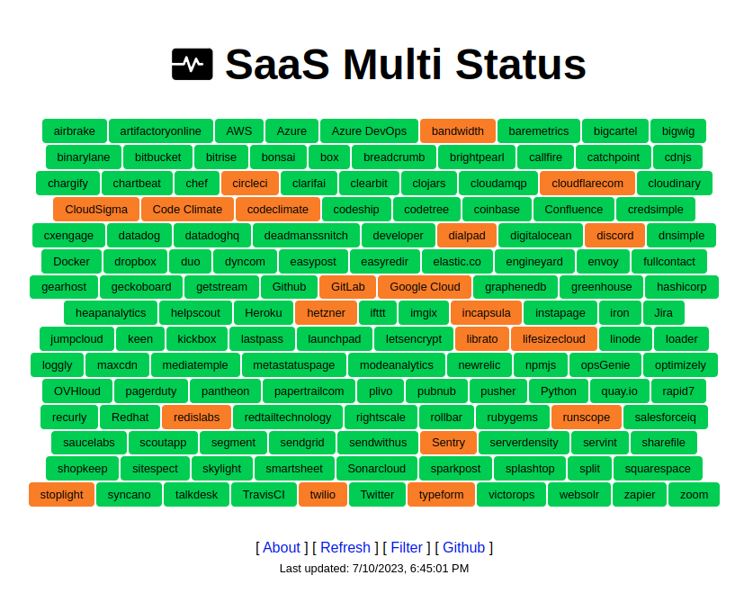

# About

This is an aggregator and a progressive web app (PWA) for status pages of many important online infrastructure services. Know which of your 3rd party SaaS/PaaS are having issues right now.

Check it out at https://lzone.de/multi-status/

## Supported Status Pages

<!-- start list -->
[AWS](https://status.aws.amazon.com/rss/all.rss) | [Akamai Edge](https://www.akamaistatus.com/history.atom) | [Ariscloud](https://status-public.ariscloud.com/history.atom) | [Azure DevOps](https://status.dev.azure.com/_rss) | [Azure](https://azurestatuscdn.azureedge.net/en-us/status/feed/) | [CloudSigma](http://status.cloudsigma.com/history.atom) | [Cloudways](https://status.cloudways.com/history.atom) | [Code Climate](https://status.codeclimate.com/history.atom) | [Confluence](https://confluence.status.atlassian.com/history.atom) | [Discord](https://discordstatus.com/history.atom) | [Docker](https://www.dockerstatus.com/pages/533c6539221ae15e3f000031/rss) | [ExoScale](https://exoscalestatus.com/history.atom) | [Fastly](https://www.fastlystatus.com/rss) | [GitLab](https://status.gitlab.com/pages/5b36dc6502d06804c08349f7/rss) | [Github](https://www.githubstatus.com/history.atom) | [Google Cloud](https://status.cloud.google.com/feed.atom) | [GridScale](https://status.gridscale.io/history.atom) | [Hashicorp](https://status.hashicorp.com/history.atom) | [Heroku](https://status.heroku.com/feed) | [HubSpot](https://status.hubspot.com/history.atom) | [IONOS Cloud](https://status.ionos.cloud/history.atom) | [Jira](https://jira-software.status.atlassian.com/history.atom) | [Netlify](https://www.netlifystatus.com/history.atom) | [OVHcloud](https://status.us.ovhcloud.com/pages/59dd23da8827c804746f1664/rss) | [Office 365](https://status.cloud.microsoft/api/feed/mac) | [OpenAI](https://status.openai.com/feed.atom) | [Oracle](https://ocistatus.oraclecloud.com/api/v2/incident-summary.rss) | [Paypal](https://www.paypal-status.com/feed/atom) | [Proton](https://status.proton.me/history.atom) | [Python](https://status.python.org/history.atom) | [Quad9](https://uptime.quad9.net/history.atom) | [Rackspace](https://rss.status.rackspace.com/snow/statusfeed) | [Redhat](https://status.redhat.com/history.atom) | [STACKIT](https://status.stackit.cloud/history.atom) | [Scaleway](https://status.scaleway.com/history.atom) | [Sentry](https://status.sentry.io/history.atom) | [Sonarcloud](https://sonarcloud.statuspage.io/history.atom) | [Splunk](https://status.splunkcloud.com/history.atom) | [SysDig EU](https://status-eu1.sysdig.com/history.atom) | [TravisCI](https://www.traviscistatus.com/history.atom) | [UpCloud](https://status.upcloud.com/history.atom) | [Vercel](https://www.vercel-status.com/history.rss) | [Webex](https://status.webex.com/history.rss) | [Xero](https://status.developer.xero.com/history.atom) | [airbrake](https://status.airbrake.io/history.atom) | [artifactoryonline](http://status.artifactoryonline.com/history.atom) | [bandwidth](http://status.bandwidth.com/history.atom) | [baremetrics](http://status.baremetrics.com/history.atom) | [bigwig](http://bigwig.statuspage.io/history.atom) | [binarylane](http://status.binarylane.com.au/history.atom) | [bitbucket](https://status.bitbucket.org/history.atom) | [bitrise](http://status.bitrise.io/history.atom) | [bonsai](https://status.bonsai.io/history.atom) | [box](https://status.box.com/history.atom) | [breadcrumb](http://status.breadcrumb.com/history.atom) | [callfire](http://status.callfire.com/history.atom) | [catchpoint](http://status.catchpoint.com/history.atom) | [cdnjs](https://status.cdnjs.com/history.atom) | [chartbeat](https://chartbeat.statuspage.io/history.atom) | [chef](https://status.chef.io/history.atom) | [circleci](https://circleci.statuspage.io/history.atom) | [clarifai](http://status.clarifai.com/history.atom) | [claude](https://status.claude.com/history.atom) | [clearbit](http://status.clearbit.com/history.atom) | [clojars](https://clojars.statuspage.io/history.atom) | [cloudamqp](http://status.cloudamqp.com/history.atom) | [cloudflarecom](https://www.cloudflarestatus.com/history.atom) | [cloudinary](https://status.cloudinary.com/history.atom) | [codeclimate](http://status.codeclimate.com/history.atom) | [codeship](http://codeship.statuspage.io/history.atom) | [codetree](http://status.codetree.com/history.atom) | [coinbase](https://coinbase.statuspage.io/history.atom) | [credsimple](https://status.credsimple.com/history.atom) | [cxengage](http://status.cxengage.com/history.atom) | [datadog](https://datadog.statuspage.io/history.atom) | [datadoghq](https://status.datadoghq.com/history.atom) | [deadmanssnitch](http://status.deadmanssnitch.com/history.atom) | [dialpad](https://status.dialpad.com/history.atom) | [digitalocean](https://status.digitalocean.com/history.atom) | [discord](https://discord.statuspage.io/history.atom) | [dnsimple](https://dnsimple.statuspage.io/history.atom) | [dropbox](https://status.dropbox.com/history.atom) | [duo](https://status.duo.com/history.atom) | [easypost](https://easypost.statuspage.io/history.atom) | [elastic.co](https://status.elastic.co/history.atom) | [engineyard](https://engineyard.statuspage.io/history.atom) | [envoy](https://status.envoy.com/history.atom) | [gearhost](https://gearhost.statuspage.io/history.atom) | [geckoboard](https://geckoboard.statuspage.io/history.atom) | [gemini](https://status.gemini.com/history.atom) | [getstream](http://status.getstream.io/history.atom) | [godaddy](https://status.godaddy.com/history.atom) | [grafana cloud](https://status.grafana.com/history.atom) | [greenhouse](https://greenhouse.statuspage.io/history.atom) | [hashicorp](https://status.hashicorp.com/history.atom) | [heapanalytics](http://status.heapanalytics.com/history.atom) | [helpscout](https://status.helpscout.net/history.atom) | [hetzner](https://status.hetzner.com/de.atom) | [huggingface](https://status.huggingface.co/feed) | [ifttt](http://status.ifttt.com/history.atom) | [imgix](https://status.imgix.com/history.atom) | [incapsula](https://status.incapsula.com/history.atom) | [instapage](https://status.instapage.com/history.atom) | [iron](https://status.iron.io/history.atom) | [jumpcloud](http://status.jumpcloud.com/history.atom) | [keen](http://status.keen.io/history.atom) | [kickbox](http://status.kickbox.io/history.atom) | [klarna](https://status.klarna.com/history.atom) | [lastpass](https://status.lastpass.com/history.atom) | [launchpad](https://launchpad.statuspage.io/history.atom) | [letsencrypt](https://letsencrypt.status.io/pages/55957a99e800baa4470002da/rss) | [librato](https://status.librato.com/history.atom) | [lifesizecloud](http://status.lifesizecloud.com/history.atom) | [linode](https://status.linode.com/history.atom) | [loader](http://status.loader.io/history.atom) | [loggly](http://status.loggly.com/history.atom) | [maxio](https://maxio.statuspage.io/history.atom) | [metastatuspage](http://metastatuspage.com/history.atom) | [modeanalytics](http://status.modeanalytics.com/history.atom) | [newrelic](https://status.newrelic.com/history.atom) | [npmjs](https://status.npmjs.org/history.atom) | [opsGenie](https://opsgenie.status.atlassian.com/history.atom) | [optimizely](http://status.optimizely.com/history.atom) | [pantheon](https://status.pantheon.io/history.atom) | [plivo](https://status.plivo.com/history.atom) | [pubnub](http://status.pubnub.com/history.atom) | [pusher](https://status.pusher.com/history.atom) | [quay.io](https://status.quay.io/history.atom) | [rapid7](https://status.rapid7.com/history.atom) | [recurly](https://status.recurly.com/statuspage/recurly/subscribe/rss) | [redislabs](https://status.redislabs.com/history.atom) | [redtailtechnology](http://status.redtailtechnology.com/history.atom) | [rightscale](http://status.rightscale.com/history.atom) | [rollbar](http://status.rollbar.com/history.atom) | [rootly](https://status.rootly.com/history.atom) | [rubygems](https://status.rubygems.org/history.atom) | [runscope](http://status.runscope.com/history.atom) | [salesforceiq](https://status.salesforceiq.com/history.atom) | [saucelabs](https://status.saucelabs.com/history.atom) | [scoutapp](https://status.scoutapp.com/history.atom) | [segment](https://status.segment.com/history.atom) | [sendgrid](http://status.sendgrid.com/history.atom) | [sendwithus](https://status.sendwithus.com/history.atom) | [serverdensity](https://status.density.io/history.atom) | [servint](https://servint.statuspage.io/history.atom) | [sharefile](http://status.sharefile.com/history.atom) | [shopify](https://www.shopifystatus.com/history.atom) | [shopkeep](http://status.shopkeep.com/history.atom) | [sitespect](http://status.sitespect.com/history.atom) | [skylight](http://status.skylight.io/history.atom) | [smartsheet](https://status.smartsheet.com/history.atom) | [sparkpost](https://status.sparkpost.com/history.atom) | [splashtop](http://status.splashtop.com/history.atom) | [split](https://status.split.io/history.atom) | [squarespace](https://status.squarespace.com/history.atom) | [status.io](https://status.status.io/pages/51f6f2088643809b7200000d/rss) | [stoplight](http://status.stoplight.io/history.atom) | [syncano](http://syncano.statuspage.io/history.atom) | [talkdesk](http://status.talkdesk.com/history.atom) | [twilio](https://twilio.statuspage.io/history.atom) | [typeform](http://status.typeform.com/history.atom) | [urllo](https://urllo.statuspage.io/history.atom) | [victorops](https://status.victorops.com/history.atom) | [websolr](http://status.websolr.com/history.atom) | [zapier](https://status.zapier.com/history.atom) | [zoom](https://status.zoom.us/history.atom)
<!-- end list -->

If you are missing a status page feel free to add it to `conf/feeds.json`
and to create a PR!
 
## Todos

- Backend
  - Strip bad encodings

- Frontend
  - better layout for details

## Setup

Prepare git repo

    git submodule init
    git submodule update

Run backend updater

    cd backend
    npm i
    ./update.js ../frontend/data.json

Serve frontend for testing with

    cd frontend
    npm i
    npm start
